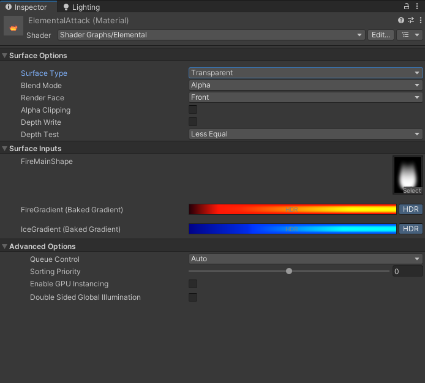
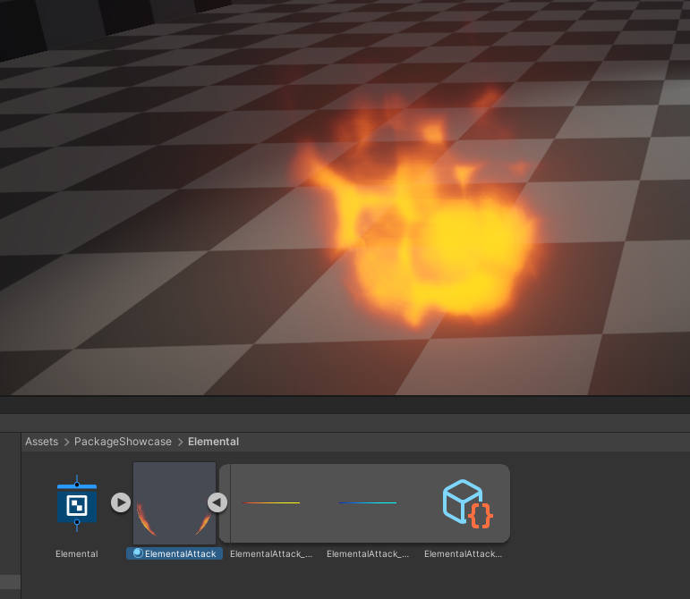
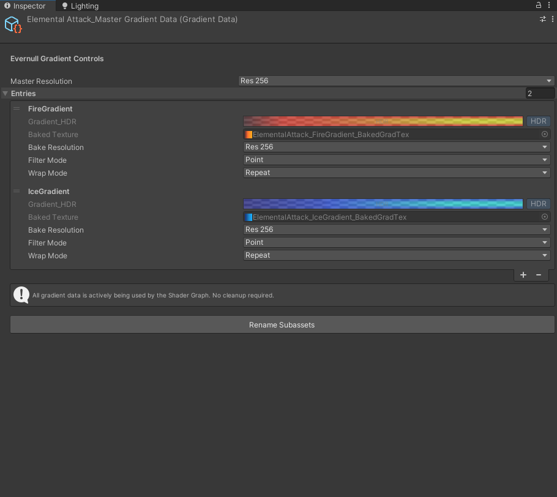

# But how does it work?

### Material Inspector

!!! info ""

    You can see here how the material Inspector looks for our example shader.

### Folder Structure

!!! info ""

    And here you can see how the folder structure looks.

!!! info "Textures"

    We just have 256x1(by default) textures for every single gradient property. Those textures change and get rebaked immediately as you change the gradient properties keys.

### Scriptable Object

!!! info

    GradientData scriptable objects exist as a sub-asset under every material that uses gradients. They are there to keep, manage, clean-up data. 
    
    We need this because materials do not know about what a Gradient is, therefore they cannot reliably understand, serialize, keep/remember that data type. 
    
    The GradientData(ScriptableObject) solves all those problems by keeping the references to the ShaderProperties, GradientTextures and remembers which texture belongs to which property. 
    
    The material simply references the baked texture.

    !!! success "The clean-up"

        When you click on this object, it checks if all the properties still exist for all the textures we have for this material. If a property was removed, it gives you a button that would clean-up
        the unused data.

        If there are no properties that use gradients anymore, this scriptable object  also deletes itself when you click that button so you do not have clutter/left-over objects from earlier states.

!!! info 

    Here, you can freely change the resolutions, filter modes, wrap modes of the created textures. 

    When you change these values, the gradients are instantly rebaked.
