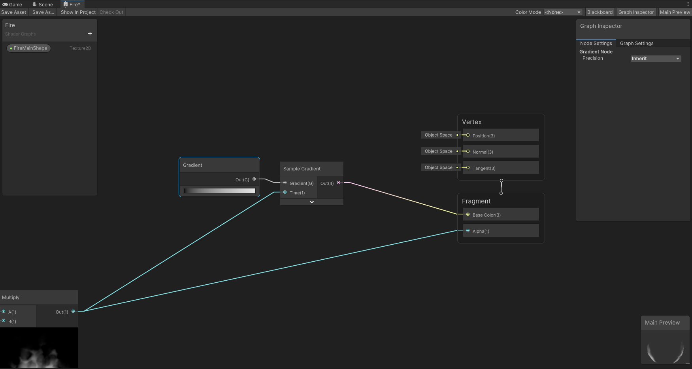
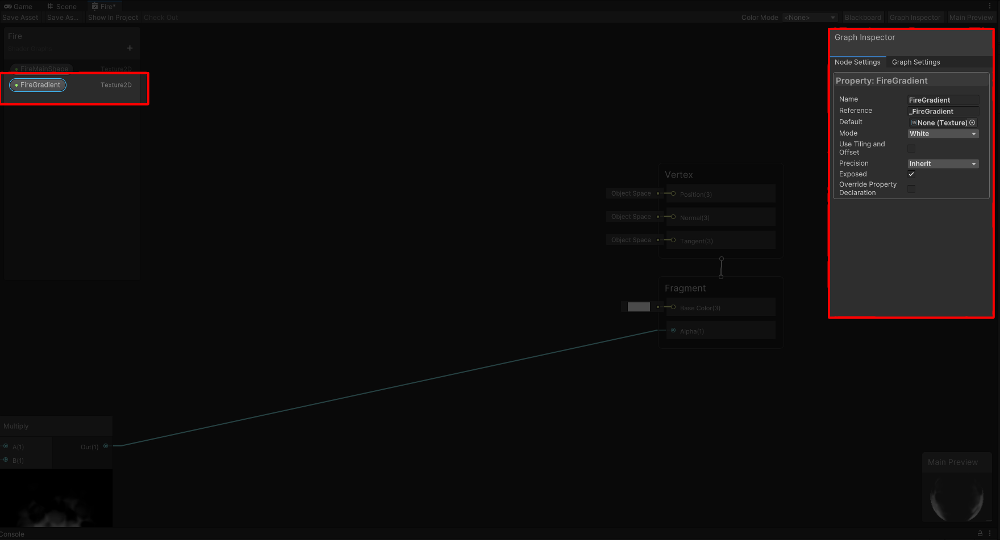
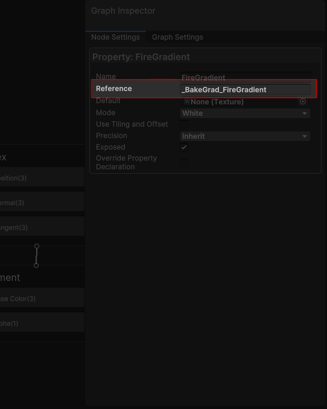
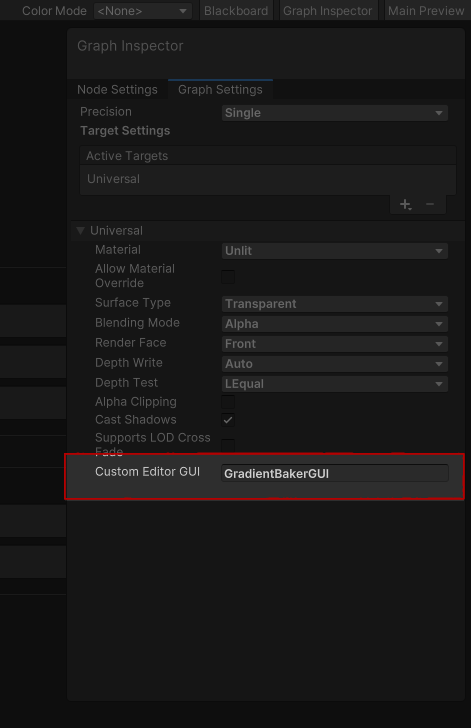
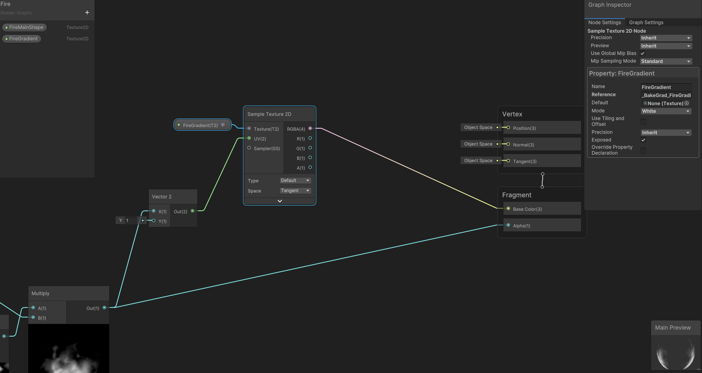

# Quick Set-up

## 1. Find where you'd like to use a gradient in your shader

I have a gradient node there that can't be exposed, we'll get rid of it.

## 2. Add a 'Texture2D' property

!!! info "The Data"

	ShaderGradients work as a texture, the GPU doesn't even know it as a gradient; it's just a very small texture as far as the GPU is concerned.

## 3. Add the prefix '____BakeGrad____' to your texture ***Reference Name***

## 4. Go to Graph Settings and change 'CustomEditorGUI'

!!! info "CustomEditorGUI = EvernullTools.GradientGUI"

    Set Custom Editor GUI to 'EvernullTools.GradientGUI'. Inspectors of Materials that use this shader will now draw using EvernullTools.GradientGUI

## 5. Use the property in your shader

!!! info 

    You can use these properties just like you would use any gradient texture you would normally bring from an image creation software.
    But now you don't ever have to go out of Unity for this. You can change it and see your changes immediately.

!!! info 

    In this shader, I've used my shape as a UV input so the gradient sampling depends on my shape. 
    You can use it any way you like.

    

